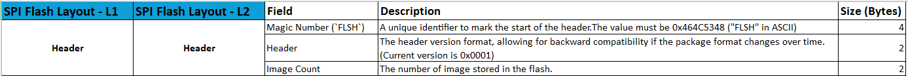
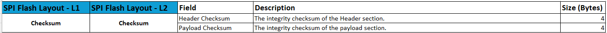
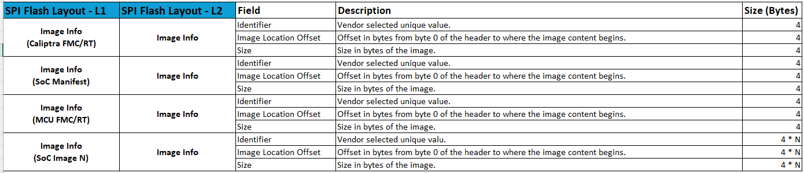
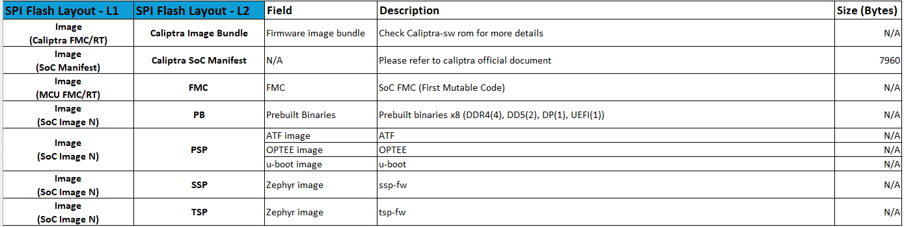

# ASPEED CPTRA_IMGTOOL

ASPEED CPTRA image tool is to packages the SoC image into caliptra flash image layout. This includes the 
caliptra-core and caliptra-mcu runtime images, the Caliptra SoC manifest, prebuilt binaries and the 
bootloaders for the AST27xxA2 platform.

This flash image layout is divided four parts, header, checksum, image infromation, and image binary.
If you want to know more detail about soc manifest, please refer to [Caliptra SoC Manifest](https://github.com/chipsalliance/caliptra-sw/tree/main/auth-manifest)

## Header


## Checksum


## Image information


## Image metadata list


# Requirement
* Rustup for managing rust toolchain
    ``` bash
    curl --proto '=https' --tlsv1.2 -sSf https://sh.rustup.rs | sh
    ```
* Build caliptra-sw and caliptra-mcu-sw tool
    1. [Aspeed's caliptra-sw](https://github.com/AspeedTech-BMC/caliptra-sw)
        * Including Aspeed's proprietary feature like SVN version insert and prebuilt signature insert.
    2. [Official caliptra-mcu-sw](https://github.com/chipsalliance/caliptra-mcu-sw)
        * If you are developing on the AST27XXA2 platform, you must apply the fix from commit  2b7837402328ab611968d40243075082469df7ae.
    * Build command
        ``` bash
        cd cptra_imgtool

        git clone https://github.com/AspeedTech-BMC/caliptra-sw.git
        cd caliptra-sw
        git submodule update --init --recursive
        cargo build -p caliptra-auth-manifest-app --target-dir ../target
        cd ..

        git clone https://github.com/chipsalliance/caliptra-mcu-sw.git
        cd caliptra-mcu-sw
        git reset --hard 2b7837402328ab611968d40243075082469df7ae
        cargo build -p xtask --target-dir ../target
        cd ..
        ```
    * Your folder structure will look like this:
        ``` bash
        cptra_imgtool
        ├── caliptra-sw
        └── caliptra-mcu-sw
        ``` 

---

# Build only the Caliptra SoC Manifest
### Basic command with a specified config path:
``` bash
cargo run create-auth-man --cfg config/ast2700-default-manifest.toml
# Output: out/ast2700-default-auth-manifest.bin
```

### Command Options
  
The create-auth-man command supports the following arguments:

| Argument                  | Required | Description                                                                                    |
| ------------------------- | -------- | ---------------------------------------------------------------------------------------------- |
| `--cfg <String>`          | Yes      | Path to the configuration file used to generate the manifest.                                  |
| `--man <FILE>`            | No       | Output path for the generated manifest file. If not provided, the default output path is used. |
| `--key-dir <String>`      | No       | Directory containing the keys needed for manifest generation.                                  |
| `--prebuilt-dir <String>` | No       | Directory containing prebuilt binaries required by the manifest.                               |


Example with Optional Arguments
``` bash
cargo run create-auth-man \
    --cfg config/ast2700-default-manifest.toml \
    --man out/soc-manifest.bin \
    --key-dir keys/ast2700-default/ \
    --prebuilt-dir prebuilt/ast2700-default/
```

---

# Build the Caliptra Flash Image (including the Caliptra SoC manifest)
### Basic command with a specified config path:
``` bash
cargo run create-auth-flash --cfg config/ast2700-default-manifest.toml
# Output: out/ast2700-default-flash-image.bin
```

### Command Options

The create-auth-flash command supports the following arguments:

| Argument                  | Required | Description                                                                                                        |
| ------------------------- | -------- | ------------------------------------------------------------------------------------------------------------------ |
| `--cfg <String>`          | Yes      | Path to the configuration file used to generate the flash image.                                                   |
| `--man <FILE>`            | No       | Input manifest file. If not provided, the tool automatically generates the manifest based on the specified config. |
| `--flash <FILE>`          | No       | Output path for the generated flash image file. If not provided, the tool outputs to the default path shown above. |
| `--key-dir <String>`      | No       | Directory containing the keys required for building the flash image.                                               |
| `--prebuilt-dir <String>` | No       | Directory containing prebuilt binaries used when assembling the flash image.                                       |


Example with Optional Arguments
``` bash
cargo run create-auth-flash \
    --cfg config/ast2700-default-manifest.toml \
    --man out/ast2700-default-auth-manifest.bin \
    --flash out/custom-flash-image.bin \
    --key-dir keys/ast2700-default/ \
    --prebuilt-dir prebuilt/ast2700-default/
```

---

# TOML Configuration Description
The configuration file defines parameters used during manifest generation and flash image construction.
### manifest_config fields


| Field              | Description                                                                                                                                                                         |
| ------------------ | ----------------------------------------------------------------------------------------------------------------------------------------------------------------------------------- |
| `version`          | Manifest format version. **Keep unchanged** unless the platform requires an update.                                                                                                 |
| `flags`            | Manifest flags. **Keep unchanged** unless explicitly specified by the platform.                                                                                                     |
| `security_version` | Security version used for **anti-rollback protection**. Higher values represent newer firmware. Devices will reject firmware with a lower `security_version` than the stored value. |
| `prj_name`         | Optional. If omitted, default directories and filenames are used. If set, it affects the **default key directory**, **prebuilt directory**, and **output binary naming**.           |

### Secure Boot–Related Key Configuration
  
The following sections determine which keys are used for signing and are directly tied to the platform’s secure boot policy.

| Section                   | Purpose                               |
| ------------------------- | ------------------------------------- |
| `[vendor_fw_key_config]`  | Vendor firmware signing key settings. |
| `[vendor_man_key_config]` | Vendor manifest signing key settings. |
| `[owner_fw_key_config]`   | Owner firmware signing key settings.  |
| `[owner_man_key_config]`  | Owner manifest signing key settings.  |

The cptra image tool locates keys using the key name defined in this configuration.  
If you need to use a different key, replace the original key file at the specified location.
```
    ├── key
    │   ├── ast2700-default
    │   │   ├── own-fw-ecc-prvk.pem
    │   │   ├── own-fw-ecc-pubk.pem
    │   │   ├── own-fw-lms-prvk.pem
    │   │   ├── own-fw-lms-pubk.pem
                  :
```

### Runtime Image List
| Field           | Description                                                              |
| --------------- | ------------------------------------------------------------------------ |
| `caliptra_file` | The Caliptra firmware image. Please specify the final `caliptra-fw.bin`. |
| `mcu_file`      | The first mutable code executed during boot (e.g., `zephyr-mcu-runtime.bin`).    |

### Image Metadata List

The `image_metadata_list` defines the metadata entries included in the manifest or flash layout.  

If you want to remove an image from manifest or flash layout, locate its corresponding metadata entriy  
and set `file = ""` and `load_stage = 0`.

```
[[image_metadata_list]]
file = ""
source = 1
fw_id = 13
ignore_auth_check = false
load_stage = 0
```

#### Rules

1. **The first entry must always describe the FMC (First Mutable Code).**  
   This is essential for establishing the boot chain.

2. **Subsequent entries should follow the FMC boot sequence.**  
   These may vary depending on the platform’s boot flow, such as:

   - ddr_train.bin
   - atf.bin 
   - optee.bin
   - uboot.bin

### Image Update
If you want to package new firmware using cptra image tool, replace the image and run cptra image tool command.

The image file structure like this:
```
├── prebuilt
│   ├── ast2700-default
│   │   ├── atf.bin
│   │   ├── caliptra-fw.bin
│   │   ├── ddr4_2d_pmu_train_dmem.bin
│   │   ├── ddr4_2d_pmu_train_imem.bin
                   :
```

Example: Update atf.bin
``` bash
# Suppose you have built a new atf binary named xxxx_atf.bin
cp xxxx_atf.bin prebuilt/ast2700-default/atf.bin
cargo run create-auth-flash \
    --cfg config/ast2700-default-manifest.toml
```

---

# Secure Boot Configuration
When Secure Boot is enabled, the manifest must be generated using the appropriate key configuration.  
Depending on the signing scheme you intend to use, please refer to the following predefined configurations:

- **Secure boot disabe**  
  Use this configuration if the platform disable Secure Boot:  
  `config/ast2700-default-manifest.toml`

- **ECC Only**  
  Use this configuration if the platform enables Secure Boot with **ECC-only** signing:  
  `config/ast2700-default-ecc-manifest.toml`

- **ECC + LMS**  
  Use this configuration if the platform enables Secure Boot with a combination of **ECC and LMS** signing:  
  `config/ast2700-default-ecc-lms-manifest.toml`

Select the configuration that matches your platform's secure boot policy before generating the manifest or flash image.

---
