# ASPEED CPTRA_IMGTOOL

The ASPEED Caliptra Image Tool packages SoC images into the Caliptra flash image layout.

> [!IMPORTANT]
> **Prebuilt Binaries Notice**
>
> The `prebuilt/` folder in this repository contains **example test binaries only** and may **not** reflect the latest firmware.
>
> For the most up-to-date prebuilt binaries, please download them from:
> **[https://github.com/AspeedTech-BMC/bmc-pb](https://github.com/AspeedTech-BMC/bmc-pb)**

---

- [What it does](#what-it-does)
- [Caliptra 1.x vs Caliptra 2.x Support](#caliptra-1x-vs-caliptra-2x-support)
- [Upstream Source](#upstream-source)
- [Output Manifest Bundle Image Example](#output-manifest-bundle-image-example)
- [Manifest Bundle FLASH Layout](#manifest-bundle-flash-layout)
- [Requirements and Environment Setup](#requirements-and-environment-setup)
  - [Rust toolchain setup](#rust-toolchain-setup)
  - [Build the Caliptra Auth Manifest App and the Xtask flash tool](#build-the-caliptra-auth-manifest-app-and-the-xtask-flash-tool-required-before-using-this-tool)
- [Run Image Generation](#run-image-generation)
  - [Build only the Caliptra SoC Manifest](#build-only-the-caliptra-soc-manifest)
  - [Build the Caliptra Manifest Bundle Image (including the Caliptra SoC manifest)](#build-the-caliptra-manifest-bundle-image-including-the-caliptra-soc-manifest)
  - [Build the AST27x0A1 Caliptra Flash Image (including the Caliptra runtime image, Caliptra SoC manifest, mcu-runtime image with ASPEED header)](#build-the-ast27x0a1-caliptra-flash-image-including-the-caliptra-runtime-image-caliptra-soc-manifest-mcu-runtime-image-with-aspeed-header)
- [TOML Configuration Description](#toml-configuration-description)
  - [Image Update](#image-update)
  - [Sign Helper](#sign-helper)
- [Soc Manifest Layout](#soc-manifest-layout)
  - [Aspeed 2700 A1/A2 layout](#aspeed-2700-a1a2-layout)
  - [Trust Chain](#trust-chain)
- [Secure Boot Configuration](#secure-boot-configuration)
- [Signing Using a Sign Helper](#signing-using-a-sign-helper)
- [Building in an Offline Environment](#building-in-an-offline-environment)
---

## What it does

This tool performs two primary tasks:

1. **Generate SoC Manifest**  
   Creates a SoC manifest using the binaries specified in the TOML configuration file.

2. **Assemble Flash Image**  
   Packages all binaries together with the generated SoC manifest into a flash image that follows the layout described in the TOML configuration file.

### Caliptra SoC Manifest

In Caliptra, the **SoC manifest** is a metadata structure that describes the SoC-owned firmware/images to be loaded and verified.  
In this version, the manifest focuses on identifying each image and providing integrity-related information (e.g., image ID, flags, and digests) so the SoC can validate the included contents before use.

If you want to know more detail about soc manifest, please refer to 
- [Caliptra 1.x SoC Manifest](https://github.com/chipsalliance/caliptra-sw/tree/rt-1.2.0/auth-manifest)
- [Caliptra 2.x SoC Manifest](https://github.com/chipsalliance/caliptra-sw/tree/b27bc179c52d584717b8d4703ae5c2e101405748/auth-manifest)

### Terminology

In the following sections, we use the term **manifest bundle image** to refer to the output generated by this tool.

> **Note:** The manifest bundle image produced by this tool **does not** include the kernel FIT image, ROFS, or RWFS.

## Caliptra 1.x vs Caliptra 2.x Support

This tool supports two parallel pipelines, matching the two Caliptra generations. Which one you use depends on the CLI subcommand, not the TOML config:

| | Caliptra 1.x | Caliptra 2.x |
| --- | --- | --- |
| Commands | `create-auth-man`, `create-auth-flash` | `create-auth-man-2x`, `create-auth-flash-2x` |
| Signing | ECC, LMS | ECC, LMS, MLDSA (via `--pqc-key-type`) |
| Example platforms | AST27x0 A1/A2 | AST1040A0, AST1080A0, AST27x5-A0 |

Each pipeline has its own SoC manifest format and flash image layout, built from the matching tools under `tools/cptra_1x/` and `tools/cptra_2x/`.

## Upstream Source

This project contains code derived from:

- Project: chipsalliance/caliptra-sw
- Name: auth-manifest
  - Path: tools/cptra_1x/auth-manifest
  - Upstream License: Apache License 2.0
  - Upstream Repository: https://github.com/chipsalliance/caliptra-sw
  - Upstream Commit: <951209a31c4373658f89e4b1211f3a557731c7d9>
- Name: auth-manifest-2x
  - Path: tools/cptra_2x/auth-manifest
  - Upstream License: Apache License 2.0
  - Upstream Repository: https://github.com/chipsalliance/caliptra-sw
  - Upstream Commit: <4892e5bec3744c87b5f15648137ca71ce92154f8>

### Modifications
#### tools/cptra_1x/auth-manifest
- 2026-04-16: Support generate anti-rollback signature
- 2026-04-16: Support load stage filed in manifest flags
- 2026-04-16: Make the auth manifest tool more flexible to support different signature combinations
- 2026-04-16: Support sign helper config input
- 2026-04-16: Ime flag support svn
- 2026-05-18: Rename the Rust dependency crate import for compatibility with two versions of the auth manifest generation tool, and remove unused dependencies: caliptra-drivers and caliptra-image-elf.
- 2026-07-28: Add LMS dual-mode signing support, selecting between the Caliptra zero-leaf and full RFC 8554 authentication tree construction to match the configured LMS public key.
                                                
#### tools/cptra_2x/auth-manifest
- 2026-03-05: Add load stage field support in manifest flags.
- 2026-04-15: Rename the Rust dependency crate import for compatibility with two versions of the auth manifest generation tool.
- 2026-05-18: Remove unused dependencies: caliptra-drivers and caliptra-image-elf.

### Sync Strategy

This repository does not automatically track upstream updates.
Security fixes and functional changes from upstream must be manually reviewed and ported if necessary.

## Output Manifest Bundle Image Example
### AST27x5A0 Platform

For the AST27x5A0 platform, the generated manifest bundle binary includes:
- `caliptra-runtime` image
- caliptra ss `mcu-runtime` image
- Caliptra SoC manifest
- Prebuilt binaries
- Bootloaders

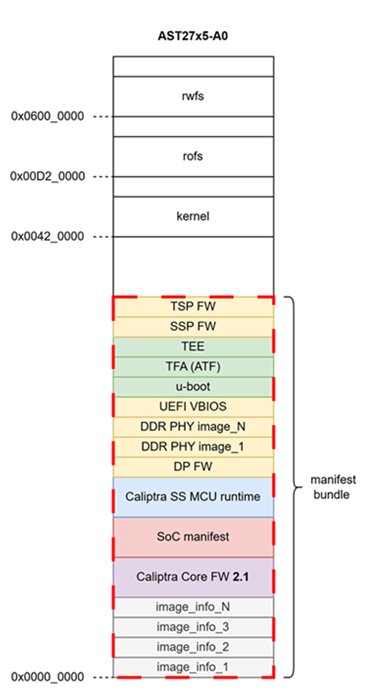

### AST27x0A2 Platform

For the AST27x0A2 platform, the generated manifest bundle binary includes:
- `caliptra-runtime` image
- `mcu-runtime` (fmc) image
- Caliptra SoC manifest
- Prebuilt binaries
- Bootloaders

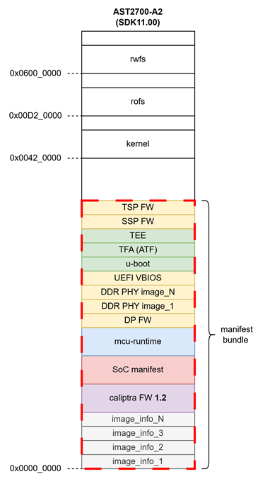

### AST27x0A1 Platform

For the AST27x0A1 platform, the generated manifest bundle binary includes:
- Caliptra SoC manifest
- Prebuilt binaries
- Bootloaders

> **Note:** The AST27x0A1 manifest bundle binary does **not** include `caliptra-runtime` or `mcu-runtime`.

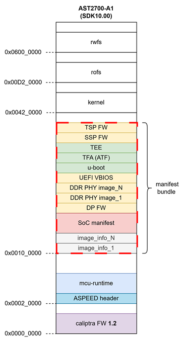

### Reference Configurations

For more details, see:
- [ast2700-default-manifest.toml](https://github.com/AspeedTech-BMC/cptra_imgtool/blob/master/config/ast2700-default-manifest.toml)
- [ast2700a1-default-manifest.toml](https://github.com/AspeedTech-BMC/cptra_imgtool/blob/master/config/ast2700a1-default-manifest.toml)
- [ast2705-default-ecc-lms-mldsa-manifest.toml](https://github.com/AspeedTech-BMC/cptra_imgtool/blob/master/config/ast2755-default-ecc-lms-mldsa-manifest.toml)

## Manifest Bundle FLASH Layout

This flash image layout is divided four parts, header, checksum, image infromation, and image binary.

> **Note:** Caliptra’s flash layout may change over time. For AST27x0 A1/A2, please refer to the following fixed version:
> [flash_layout.md](https://github.com/chipsalliance/caliptra-mcu-sw/blob/2b7837402328ab611968d40243075082469df7ae/docs/src/flash_layout.md)

### Header
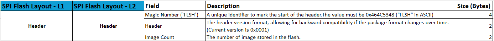

### Checksum
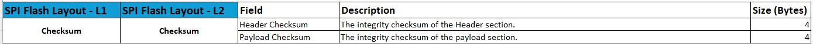

### Image information
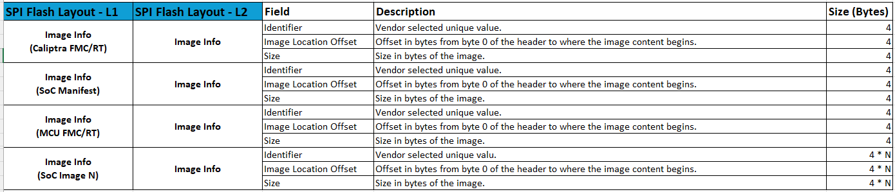

### Image metadata list
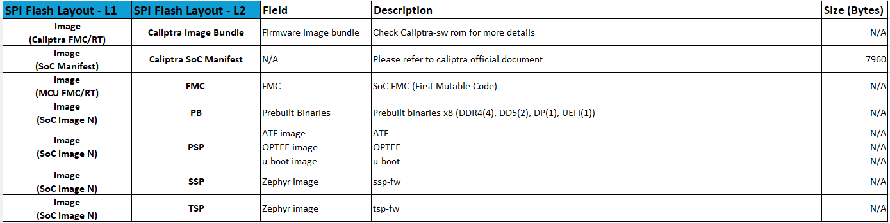

## Requirements and Environment Setup

### Rust toolchain setup

This project requires the Rust toolchain (`rustc`&nbsp;, `cargo`&nbsp;) to be installed and usable.

#### 1) Check if Rust is already installed:

```sh
cargo --version
rustc --version
```

#### 2) If missing, install Rust:

```sh
sudo apt update
sudo apt install -y build-essential curl pkg-config libssl-dev

curl --proto '=https' --tlsv1.2 -sSf https://sh.rustup.rs | sh
# Choose: 1) Proceed with installation (default)

source "$HOME/.cargo/env"
```

#### 3) Verify:
```sh
cargo --version
rustc --version
```

### Build the Caliptra Auth Manifest App and the Xtask flash tool (required before using this tool)

This tool depends on **caliptra-auth-manifest-app** and **xtask flash tool**. Please build both dependencies before using the image tool.

#### 1) [Caliptra Auth Manifest App](https://github.com/AspeedTech-BMC/cptra_imgtool/tree/master/tools/cptra_1x/auth-manifest)
* Tool to create an SoC manifest based on a TOML configuration
* Reference from upstream source [auth-manifest](https://github.com/chipsalliance/caliptra-sw/tree/951209a31c4373658f89e4b1211f3a557731c7d9/auth-manifest) 
* Including Aspeed's proprietary feature like SVN version insert and prebuilt signature insert.

#### 2) [Official Caliptra MCU SW](https://github.com/chipsalliance/caliptra-mcu-sw/tree/2b7837402328ab611968d40243075082469df7ae)
* Includes the official Caliptra xtask flash tool for certain versions.
> **IMPORTANT:** If you are developing on the AST27X0A2 or AST27X0A1 platform, you must apply the fix from commit  **2b7837402328ab611968d40243075082469df7ae**.

#### Build command
``` bash
cd cptra_imgtool

# Build caliptra-auth-manifest-app
cargo build -p caliptra-auth-manifest-app-1x
# Binary output:
# target/debug/caliptra-auth-manifest-app-1x

# Build the xtask flash tool
git clone https://github.com/chipsalliance/caliptra-mcu-sw.git tools/cptra_1x/caliptra-mcu-sw
cd tools/cptra_1x/caliptra-mcu-sw
git reset --hard 2b7837402328ab611968d40243075082469df7ae
cargo build -p xtask --target-dir ../../../target
# Binary output:
# target/debug/xtask

cd ../../..
```

* Your folder structure will look like this:
``` bash
cptra_imgtool
 ├── tools
 │   ├── cptra_1x 
 │   |   ├── auth-manifest 
 |   |   ├── caliptra-mcu-sw
``` 

---

## Run Image Generation
### Build only the Caliptra SoC Manifest
#### Basic command with a specified config path:
``` bash
# AST27x0A2 example
cargo run create-auth-man --cfg config/ast2700-default-ecc-manifest.toml
# Output: out/ast2700-default-auth-manifest.bin

# AST27x0A1 example
cargo run create-auth-man --cfg config/ast2700a1-default-ecc-manifest.toml
# Output: out/ast2700a1-default-auth-manifest.bin

# AST27x5A0 example for ML-DSA
cargo run create-auth-man-2x --cfg config/ast2705-default-ecc-lms-mldsa-manifest.toml --pqc-key-type 1
# Output: out/ast2705-default-auth-manifest.bin

# AST27x5A0 example for LMS
cargo run create-auth-man-2x --cfg config/ast2705-default-ecc-lms-mldsa-manifest.toml --pqc-key-type 3
# Output: out/ast2705-default-auth-manifest.bin
```

#### Command Options
  
The create-auth-man command supports the following arguments:

| Argument                  | Required | Description                                                                                    |
| ------------------------- | -------- | ---------------------------------------------------------------------------------------------- |
| `--cfg <String>`          | Yes      | Path to the configuration file used to generate the manifest.                                  |
| `--man <FILE>`            | No       | Output path for the generated manifest file. If not provided, the default output path is used. |
| `--key-dir <String>`      | No       | Directory containing the keys needed for manifest generation.                                  |
| `--prebuilt-dir <String>` | No       | Directory containing prebuilt binaries required by the manifest.                               |


Example with Optional Arguments
``` bash
cargo run create-auth-man \
    --cfg config/ast2700-default-ecc-manifest.toml \
    --man out/soc-manifest.bin \
    --key-dir key/ast2700-default/ \
    --prebuilt-dir prebuilt/ast2700-default/
```

---

### Build the Caliptra Manifest Bundle Image (including the Caliptra SoC manifest)
#### Basic command with a specified config path:
``` bash
# AST27x0A2 example
cargo run create-auth-flash --cfg config/ast2700-default-ecc-manifest.toml
# Output: out/ast2700-default-flash-image.bin

# AST27x0A1 example
cargo run create-auth-flash --cfg config/ast2700a1-default-ecc-manifest.toml
# Output: out/ast2700a1-default-flash-image.bin

# AST27x5A0 example for MLDSA
cargo run create-auth-flash-2x --cfg config/ast2705-default-ecc-lms-mldsa-manifest.toml --pqc-key-type 1
# Output: out/ast2705-default-flash-image.bin

# AST27x5A0 example for LMS
cargo run create-auth-flash-2x --cfg config/ast2705-default-ecc-lms-mldsa-manifest.toml --pqc-key-type 3
# Output: out/ast2705-default-flash-image.bin
```

#### Command Options

The create-auth-flash command supports the following arguments:

| Argument                  | Required | Description                                                                                                        |
| ------------------------- | -------- | ------------------------------------------------------------------------------------------------------------------ |
| `--cfg <String>`          | Yes      | Path to the configuration file used to generate the flash image.                                                   |
| `--man <FILE>`            | No       | Input manifest file. If not provided, the tool automatically generates the manifest based on the specified config. |
| `--flash <FILE>`          | No       | Output path for the generated flash image file. If not provided, the tool outputs to the default path shown above. |
| `--key-dir <String>`      | No       | Directory containing the keys required for building the flash image.                                               |
| `--prebuilt-dir <String>` | No       | Directory containing prebuilt binaries used when assembling the flash image.                                       |


Example with Optional Arguments
``` bash
cargo run create-auth-flash \
    --cfg config/ast2700-default-ecc-manifest.toml \
    --man out/ast2700-default-auth-manifest.bin \
    --flash out/custom-flash-image.bin \
    --key-dir key/ast2700-default/ \
    --prebuilt-dir prebuilt/ast2700-default/
```

---

### Build the AST27x0A1 Caliptra Flash Image (including the Caliptra runtime image, Caliptra SoC manifest, mcu-runtime image with ASPEED header)
#### Basic command with a specified config path:
``` bash
cargo run create-auth-flash --cfg config/ast2700a1-default-manifest-cptra-out-bundle.toml
# Output: out/ast2700a1-default-flash-image.bin
```

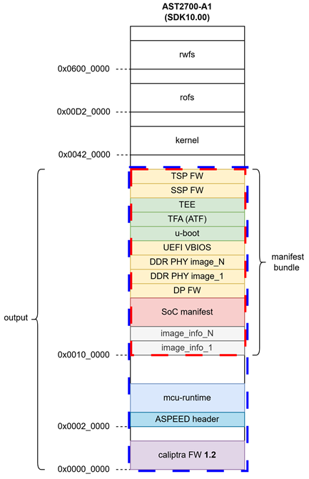


## TOML Configuration Description
The configuration file defines parameters used during manifest generation and flash image construction.
### manifest_config fields


| Field                                            | Description                                                                                                                                                                                                                                                                                                                            |
| ------------------------------------------------ | -------------------------------------------------------------------------------------------------------------------------------------------------------------------------------------------------------------------------------------------------------------------------------------------------------------------------------------- |
| `version`                                        | Manifest format version. **Keep unchanged** unless the platform requires an update.                                                                                                                                                                                                                                                    |
| `flags`                                          | Manifest flags. **Keep unchanged** unless explicitly specified by the platform.                                                                                                                                                                                                                                                        |
| `security_version`                               | Security version used for **anti-rollback protection**. Higher values represent newer firmware. Devices will reject firmware with a lower `security_version` than the stored value.                                                                                                                                                    |
| `prj_name`                                       | Optional. If omitted, default directories and filenames are used. If set, it affects the **default key directory**, **prebuilt directory**, and **output binary naming**.                                                                                                                                                              |
| `manifest_overrides_presigned_key_and_signature` | Optional. Default is true. When enabled, the public key and signature fields in the manifest are overwritten with an all-zero public key and the corresponding signature generated by the ASPEED HSM key. If set to false, the overwrite is skipped, and the manifest retains the input key and the signature generated from that key. |

### Secure Boot–Related Key Configuration
  
The following sections determine which keys are used for signing and are directly tied to the platform’s secure boot policy.

| Section                   | Purpose                               |
| ------------------------- | ------------------------------------- |
| `[vendor_fw_key_config]`  | Vendor firmware signing key settings. |
| `[vendor_man_key_config]` | Vendor manifest signing key settings. |
| `[owner_fw_key_config]`   | Owner firmware signing key settings.  |
| `[owner_man_key_config]`  | Owner manifest signing key settings.  |

The cptra image tool locates keys using the key name defined in this configuration.  
If you need to use a different key, replace the original key file at the specified location.
```
    ├── key
    │   ├── ast2700-default
    │   │   ├── own-fw-ecc-prvk.pem
    │   │   ├── own-fw-ecc-pubk.pem
    │   │   ├── own-fw-lms-prvk.pem
    │   │   ├── own-fw-lms-pubk.pem
    |   |   |     :
    |   |   |     :
```

### Runtime Image List
| Field                    | Description                                                                                                                                                                                                                                           |
| ------------------------ | ----------------------------------------------------------------------------------------------------------------------------------------------------------------------------------------------------------------------------------------------------- |
| `caliptra_file`          | The Caliptra firmware image. Please specify the final `caliptra-fw.bin`.                                                                                                                                                                              |
| `mcu_file`               | The first mutable code executed during boot (e.g., `zephyr-mcu-runtime.bin`).                                                                                                                                                                         |
| `cptra_out_bundle`       | For the AST27x0 A1 flash layout, when this option is enabled, caliptra_file and mcu_file may reside outside the manifest bundle: <br>• caliptra_file offset: 0x0000_0000 <br>• mcu_file offset: 0x0002_0000 <br>• manifest bundle offset: 0x0010_0000 |
| `zero_caliptra_file_end` | If caliptra_file is an empty string, we can set a zero-filled padding size to generate a caliptra_file of the specified length. This ensures the SoC manifest is placed at the desired flash offset.                                                  |

### Image Metadata List

The `image_metadata_list` defines the metadata entries included in the manifest or flash layout.  

| Field               | Description                                                                                                                                                                                                                                                                           |
| ------------------- | ------------------------------------------------------------------------------------------------------------------------------------------------------------------------------------------------------------------------------------------------------------------------------------- |
| `file`              | Target file name in the prebuilt folder                                                                                                                                                                                                                                               |
| `source`            | Defined in [caliptra-sw](https://github.com/chipsalliance/caliptra-sw/tree/rt-1.2.3/auth-manifest#metadata-entry-flags). Fixed value of `1` for `InRequest` in Caliptra 1.x                                                                                                           |
| `fw_id`             | Unique ID used to identify the target image                                                                                                                                                                                                                                           |
| `ignore_auth_check` | Defined in [caliptra-sw](https://github.com/chipsalliance/caliptra-sw/tree/rt-1.2.3/auth-manifest#metadata-entry-flags). If set, the image digest is not compared for the specified firmware ID                                                                                       |
| `load_stage`        | Flag used by FMC (BootMCU runtime) to determine how the image is loaded in the main boot flow:<br>• `0`: Used only by specific drivers (e.g., `ddr_xx.bin`)<br>• `1`: May be loaded by the main boot flow (e.g., `atf.bin`)<br>• `2`: Used for the next-stage booting (iRoT solution) |

If you want to remove an image from manifest or flash layout, locate its corresponding metadata entry
and set `file = ""` and `load_stage = 0`.

```
[[image_metadata_list]]
file = ""
source = 1
fw_id = 13
ignore_auth_check = false
load_stage = 0
```

#### Rules

1. **The first entry must always describe the FMC (First Mutable Code).**  
   This is essential for establishing the boot chain.

2. **Subsequent entries should follow the FMC boot sequence.**  
   These may vary depending on the platform’s boot flow, such as:

   - ddr_train.bin
   - atf.bin 
   - optee.bin
   - uboot.bin

### Image Update
If you want to package new firmware using cptra image tool, replace the image and run cptra image tool command.

> [!NOTE]
> The `prebuilt/` folder included in this repository is a **test example only**.
> Always use the latest prebuilt binaries from **[https://github.com/AspeedTech-BMC/bmc-pb](https://github.com/AspeedTech-BMC/bmc-pb)**.

The image file structure like this:
```
├── prebuilt
│   ├── ast2700-default
│   │   ├── atf.bin
│   │   ├── caliptra-fw.bin
│   │   ├── ddr4_2d_pmu_train_dmem.bin
│   │   ├── ddr4_2d_pmu_train_imem.bin
                   :
```

Example: Update atf.bin
``` bash
# Suppose you have built a new atf binary named xxxx_atf.bin
cp xxxx_atf.bin prebuilt/ast2700-default/atf.bin
cargo run create-auth-flash \
    --cfg config/ast2700-default-manifest.toml
```

### Sign Helper
The tool can sign images using a key configured in the TOML file. Alternatively, you can provide an external **signing helper** executable (e.g., written in Rust or Python) to perform the signing operation. This approach keeps private keys out of the image tool and prevents key material from being stored or revealed by the tool.

| Field                         | Description                                                                                                                                                                                                                                                                                            |
| ----------------------------- | ------------------------------------------------------------------------------------------------------------------------------------------------------------------------------------------------------------------------------------------------------------------------------------------------------ |
| owner_ecc_fw_key_sign_helper  | Command to perform signing **using the owner ECC FW key**.                                                                                                                                                                                                                                             |
| owner_ecc_man_key_sign_helper | Command to perform signing **using the owner ECC MAN key**.                                                                                                                                                                                                                                            |
| owner_lms_fw_key_sign_helper  | Command to perform signing **using the owner LMS FW key**.                                                                                                                                                                                                                                             |
| owner_lms_man_key_sign_helper | Command to perform signing **using the owner LMS MAN key**.                                                                                                                                                                                                                                            |
| by_file                       | Controls how the tool communicates with the signing helper. When `true`, the tool passes the *to-be-signed* data and receives the resulting signature via files. When `false`, the tool uses `stdin/stdout` for data/signature transfer (ensure the helper does not print extra messages to `stdout`). |

For a sample configuration, refer to
[ast2700a1-default-ecc-lms-fw-man-sign-helper-byfile-manifest.toml](https://github.com/AspeedTech-BMC/cptra_imgtool/blob/master/config/ast2700a1-default-ecc-lms-fw-man-sign-helper-byfile-manifest.toml#L135).

---

## Soc Manifest Layout

### Caliptra 1.2 original layout
Please refer to https://github.com/chipsalliance/caliptra-sw/tree/rt-1.2.0/auth-manifest

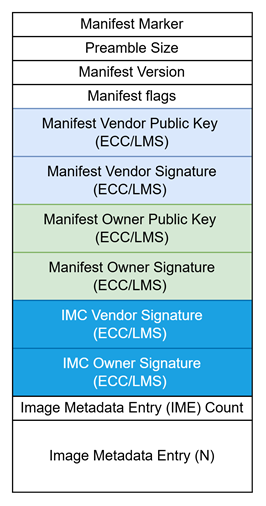

### Aspeed 2700 A1/A2 layout
To support anti-rollback, our layout adds an **SVN** field and an **owner signature that covers the SVN value**.

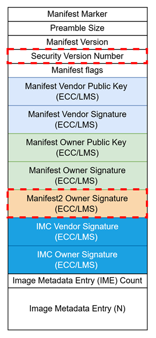

### Key and Signature Relationships in the ASPEED AST2700 A1/A2 SoC Manifest
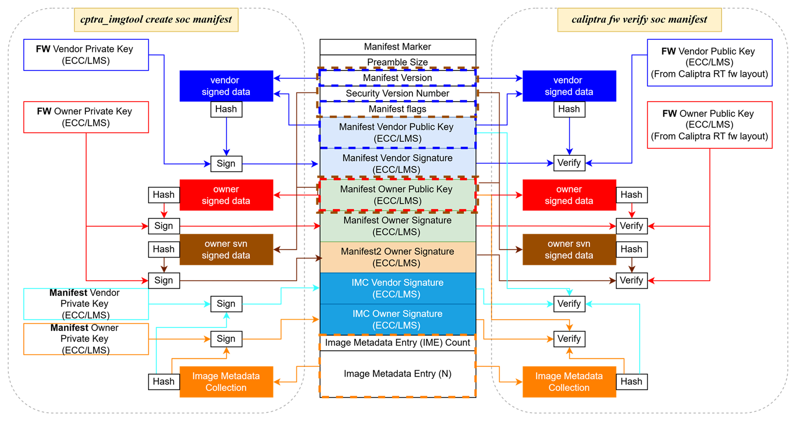

### Trust Chain

The trust chain for the AST2700 A1/A2 SoC manifest and IMC is as follows:

- **Vendor chain**: `Fuse/OTP vendor PK hash → Caliptra FW vendor key → SoC manifest vendor key → IMC`
- **Owner chain**: `Fuse/OTP owner PK hash → Caliptra FW owner key → SoC manifest owner key → IMC`

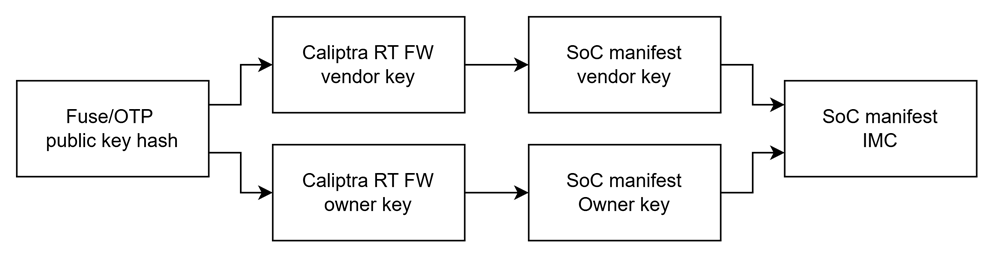

### Manifest Vendor Signature Generation

As described in the trust chain above, the SoC manifest **vendor key** must be endorsed (signed) by the **vendor key** in Caliptra RT FW.

However, the ASPEED FW vendor key is protected by an HSM and cannot be released for each vendor to perform signing. Therefore, the **Manifest Vendor Signature** is currently **pre-generated** and stored as a binary blob (stored in **src/vnd_sig/**).

In the current flow, regardless of what value is provided as the vendor FW key (or what signature is produced during the tool run), the generated **Manifest Vendor Signature** will always be **overwritten** by the prebuilt signature. As a result, the **Manifest Vendor Public Key** and **Manifest Vendor Signature** are fixed to constant values.

## Secure Boot Configuration
When Secure Boot is enabled, the manifest must be generated using the appropriate key configuration.  
Depending on the signing scheme you intend to use, please refer to the following predefined configurations:

- **Secure boot disabe**  
  Use this configuration if the platform disable Secure Boot:  
  `config/ast2700-default-manifest.toml`

- **ECC Only**  
  Use this configuration if the platform enables Secure Boot with **ECC-only** signing:  
  `config/ast2700-default-ecc-manifest.toml`

- **ECC + LMS**  
  Use this configuration if the platform enables Secure Boot with a combination of **ECC and LMS** signing:  
  `config/ast2700-default-ecc-lms-manifest.toml`

Select the configuration that matches your platform's secure boot policy before generating the manifest or flash image.

## Signing Using a Sign Helper

The tool supports two signing modes. By default, it can sign using keys provided in the TOML configuration.  
Alternatively, you can use an external **sign helper** executable (e.g., implemented in Rust or Python) to perform the signing step. This allows the signing keys to remain outside the image tool and avoids storing or exposing key material within the tool.

For parameter configuration, please refer to: [Sign Helper](#sign-helper)

For a sample configuration, refer to
[ast2700a1-default-ecc-lms-fw-man-sign-helper-byfile-manifest.toml](https://github.com/AspeedTech-BMC/cptra_imgtool/blob/master/config/ast2700a1-default-ecc-lms-fw-man-sign-helper-byfile-manifest.toml#L135).

### Sign Helper Examples

We provide both Python and Rust sign helper examples in the **sign_helper_example** directory.  
Please refer to `sign_helper_example/ecc_sign_helper.py` and `sign_helper_example/rust_sign_helper`.

### rust_sign_helper example

Compile the `rust_sign_helper` example (ensure **caliptra-sw** has been cloned).
``` bash
cd sign_helper_example/rust_sign_helper/
cargo build
```

### Data Transfer Between the Tool and Sign Helper

The tool supports two methods to pass the **to-be-signed** data to the sign helper and receive the resulting **signature**:

- **By file**: the tool writes the input to a file and reads the signature back from a file.
- **By stdin/stdout**: the tool sends the input via `stdin` and reads the signature from `stdout`.

The transfer method is configurable in the TOML file via `by_file`.

- **By file**
  - [Tool-side send/receive implementation](https://github.com/AspeedTech-BMC/caliptra-sw/blob/aspeed-rt-1.2.0/auth-manifest/gen/src/generator.rs#L568)
  - [Sign-helper-side example implementation](https://github.com/AspeedTech-BMC/cptra_imgtool/blob/master/sign_helper_example/rust_sign_helper/src/main.rs#L83)
- **By stdin/stdout**
  - [Tool-side send/receive implementation](https://github.com/AspeedTech-BMC/caliptra-sw/blob/aspeed-rt-1.2.0/auth-manifest/gen/src/generator.rs#L623)
  - [Sign-helper-side example implementation](https://github.com/AspeedTech-BMC/cptra_imgtool/blob/master/sign_helper_example/rust_sign_helper/src/main.rs#L117)

### Sign Helper Assignment for FW Key and Manifest Key

There are two ways to use the sign helper:

1. **Use the sign helper for both FW owner private key and Manifest owner private key**  
   The TOML file does not contain the FW owner private key or the Manifest owner private key. Both signing operations are performed by the sign helper.  
   In this mode, the TOML file includes only the **Manifest owner public key**.  
   Please refer to: [ast2700a1-default-ecc-lms-fw-man-sign-helper-byfile-manifest.toml](https://github.com/AspeedTech-BMC/cptra_imgtool/blob/master/config/ast2700a1-default-ecc-lms-fw-man-sign-helper-byfile-manifest.toml).

2. **Use the sign helper for FW owner private key only**  
   The TOML file does not contain the FW owner private key, and FW signing is performed by the sign helper.  
   The TOML file stores the **Manifest owner key pair** (public/private), which is used for manifest signing.  
   Please refer to: [ast2700a1-default-ecc-lms-fw-sign-helper-stdin-manifest.toml](https://github.com/AspeedTech-BMC/cptra_imgtool/blob/master/config/ast2700a1-default-ecc-lms-fw-sign-helper-stdin-manifest.toml).

---

## Building in an Offline Environment

This section describes how to build `cptra_imgtool` in an environment without internet access.  
The strategy is to perform a full build on an online machine first to populate a local Cargo cache, then transfer everything to the offline machine.

### Step 1: Build on an Online Machine

Set a custom `CARGO_HOME` pointing to a directory inside the project so it can be copied along with the source tree. Then run all build commands normally to fetch and cache all dependencies.

``` bash
cd cptra_imgtool

# Use a project-local directory as CARGO_HOME so it can be easily transferred
export CARGO_HOME=$(pwd)/offline_cargo_home

# Build caliptra-auth-manifest-app
cargo build -p caliptra-auth-manifest-app-1x
# Binary output:
# target/debug/caliptra-auth-manifest-app-1x

# Build the xtask flash tool
git clone https://github.com/chipsalliance/caliptra-mcu-sw.git tools/cptra_1x/caliptra-mcu-sw
cd tools/cptra_1x/caliptra-mcu-sw
git reset --hard 2b7837402328ab611968d40243075082469df7ae
cargo build -p xtask --target-dir ../../../target
# Binary output:
# target/debug/xtask

cd ../../..

# Run once to download and cache the main binary's dependencies,
# and to verify that the tools compile and run correctly
cargo run -- create-auth-man --cfg config/ast2700-default-ecc-manifest.toml
cargo run -- create-auth-flash --cfg config/ast2700-default-ecc-manifest.toml
```

After these commands complete, `offline_cargo_home/` will contain the full Cargo registry cache and all git-sourced dependencies required to build the project.

### Step 2: Transfer to the Offline Machine

Copy the entire `cptra_imgtool` directory (including `offline_cargo_home/` and `tools/cptra_1x/caliptra-mcu-sw/`) to the offline machine.

``` bash
# On the online machine — create a transferable archive
tar -czf cptra_imgtool_offline.tar.gz cptra_imgtool/
```

Then transfer `cptra_imgtool_offline.tar.gz` to the offline machine and extract it.

``` bash
# On the offline machine
tar -xzf cptra_imgtool_offline.tar.gz
```

> **Note:** Make sure the Rust toolchain (`cargo`, `rustc`) is also installed on the offline machine with the same version used during the online build. You can check the required toolchain version in `rust-toolchain.toml`.

### Step 3: Build on the Offline Machine

Point `CARGO_HOME` to the transferred cache directory and add `--offline` to all `cargo` commands to prevent any network access.

``` bash
cd cptra_imgtool
export CARGO_HOME=$(pwd)/offline_cargo_home

# Build caliptra-auth-manifest-app
cargo build -p caliptra-auth-manifest-app-1x --offline
# Binary output:
# target/debug/caliptra-auth-manifest-app-1x

# Build the xtask flash tool
cd tools/cptra_1x/caliptra-mcu-sw
cargo build -p xtask --target-dir ../../../target --offline
# Binary output:
# target/debug/xtask

cd ../../..
```

For image generation commands, add `--offline` after `run`:

``` bash
# Build only the Caliptra SoC Manifest
cargo run --offline -- create-auth-man --cfg config/ast2700-default-ecc-manifest.toml

# Build the Caliptra Manifest Bundle Image
cargo run --offline -- create-auth-flash --cfg config/ast2700-default-ecc-manifest.toml
```

### Summary

| Step | Machine | Action |
| ---- | ------- | ------ |
| 1 | Online  | Set `CARGO_HOME`, run all `cargo build` commands to populate the cache |
| 2 | Online → Offline | Copy entire `cptra_imgtool/` directory (including `offline_cargo_home/`) |
| 3 | Offline | Set `CARGO_HOME` to the same path, add `--offline` to all `cargo` commands |

---
